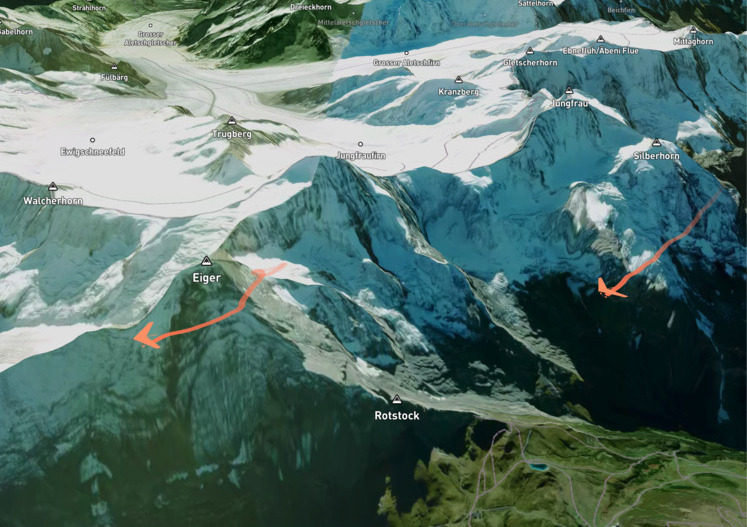

# Flight replay

Replay GPS paraglider flight data showing detailed 3D terrain and flight trails



This is a [Next.js](https://nextjs.org/) project bootstrapped with [`create-next-app`](https://github.com/vercel/next.js/tree/canary/packages/create-next-app).

## Getting Started

First, run the development server:

```bash
npm run dev
# or
yarn dev
```

Open [http://localhost:3000](http://localhost:3000) with your browser to see the result.

## License

Flight Reply source code is free non-commercial usage. If you want to use it in a commercial project, please <a href="mailto:ilya@boyandin.me?subject=FlightReply">reach out to us</a>.

<a rel="license" href="http://creativecommons.org/licenses/by-nc/4.0/"></a><br />This work is licensed under a <a rel="license" href="http://creativecommons.org/licenses/by-nc/4.0/">Creative Commons Attribution-NonCommercial 4.0 International License</a>.
